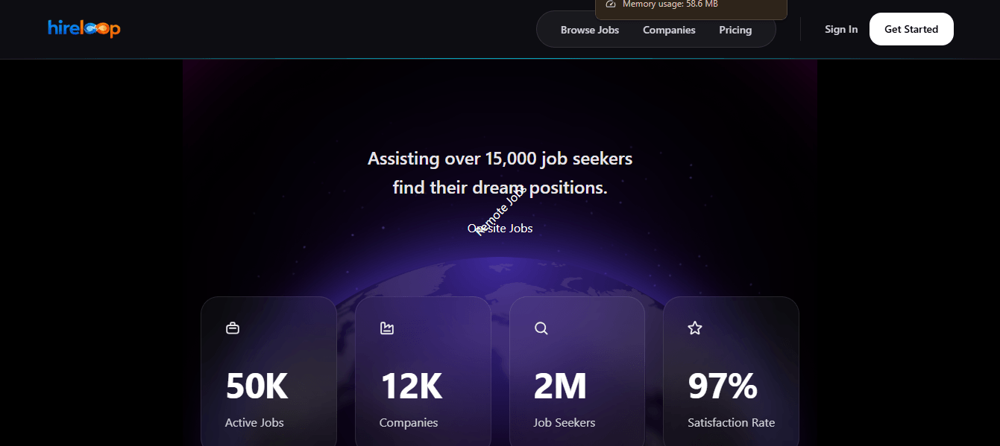

# 💼 HireLoop

A modern and responsive MERN Stack job portal that connects job seekers with employers. HireLoop allows users to browse jobs, post job opportunities, apply for positions, and manage applications through a clean and user-friendly interface.

## 🌐 Live Website

🔗 https://hireloop-client-cyan.vercel.app

## 📂 Client Repository

🔗 https://github.com/rashedpine83/HireLoop-Client

## 📂 Server Repository

🔗 https://github.com/rashedpine83/HireLoop-Server

---

## 📖 Project Overview

HireLoop is a full-stack job portal built with the MERN Stack. It enables employers to post and manage job listings while allowing job seekers to explore opportunities and apply for suitable positions. The application focuses on providing a smooth, secure, and responsive user experience.

---

## ✨ Key Features

- 🔐 Secure user authentication with Firebase Authentication
- 👨‍💼 Role-based access for employers and job seekers
- 📝 Create, update, and delete job postings
- 🔍 Search and filter jobs by category
- 📄 View detailed job information
- 📬 Apply for jobs with a simple application process
- 📱 Fully responsive design for mobile, tablet, and desktop
- ⚡ Fast and intuitive user interface

---

## 🛠️ Technologies Used

### Frontend

- Next Js
- Tailwind CSS
- HeroUI
- JavaScript
- Better Auth Authentication
- React Icons
- React toast

### Backend

- Node.js
- Express.js
- MongoDB
- JWT Authentication
- CORS
- Dotenv

---

## 📸 Screenshot

## 📬 Contact

**Nur Hossain Rashed**

📧 Email: rashedpine83@gmail.com

🌐 GitHub: https://github.com/rashedpine83

---

## ⭐ Support

If you like this project, don't forget to ⭐ star the repository.
